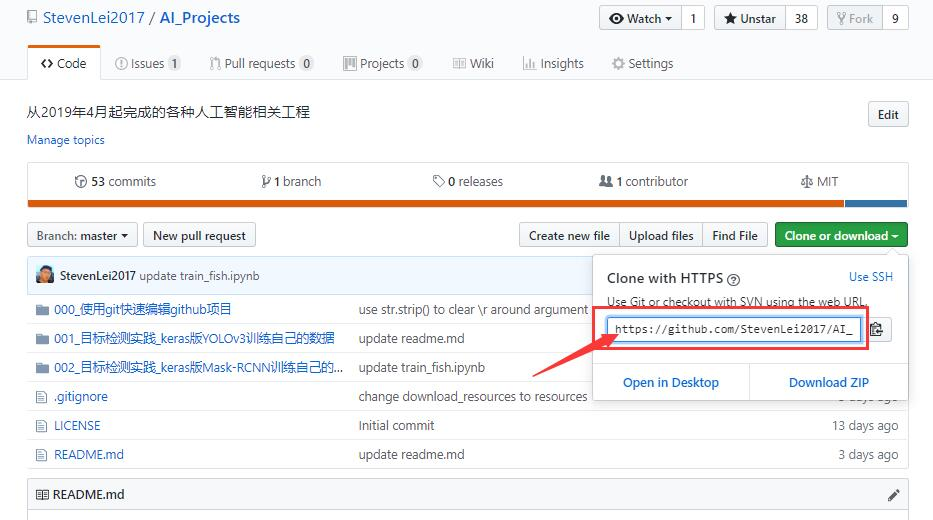

# 使用git快速编辑github项目
## 下载资源
阅读[resources/readme.md](resources/)，并完成其中内容。

## 远程仓库下载到本地仓库
1. `git clone {}`，大括号替换为git项目的url地址
* 如下图红色箭头标记处所示，方框中有此git项目的url地址：

## 本地仓库上传到远程仓库
把本地仓库的更新上传到远程仓库，需要按顺序运行下面4个命令：
1. `git pull`，作用是把远程仓库的最新分支下载到本地仓库；
2. `git add .`，作用是把本地仓库新修改的文件添加到master分支中；
3. `git commit -m "{}"`，大括号替换为本次提交的描述信息，作用是把master分支的更新内容提交到本地仓库并记录本次提交的描述信息；
4. `git push origin master`，作用是把本地仓库的更新上传到远程仓库。
