# 下载资源
本文件夹包含代码运行需要的各种资源，包括：软件安装包、代码运行依赖库、图片数据、文本数据等

## 下载链接
* 读者需要在百度云盘下载压缩文件`000_resources.zip`
* 下载链接: https://pan.baidu.com/s/1XLElsqMPwDEwvn1HsjrY5A 提取码: zmh3

## 解压后示意图
压缩文件解压后，文件夹`resources`中应该如下图所示：
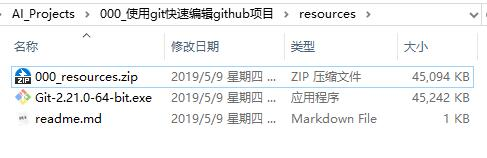

## 1.在Windows10系统安装git2.21.0
1. 使用鼠标双击安装文件`Git-2.21.0-64-bit.exe`，显示安装界面程序，如下图所示：
* 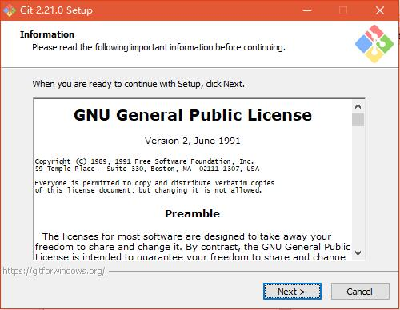
2. 点击`Next`按钮，如下图红色箭头标记处所示：
* 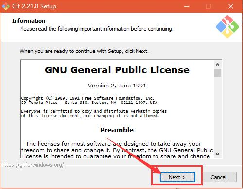
3. 点击`Next`按钮，如下图红色箭头标记处所示：
* 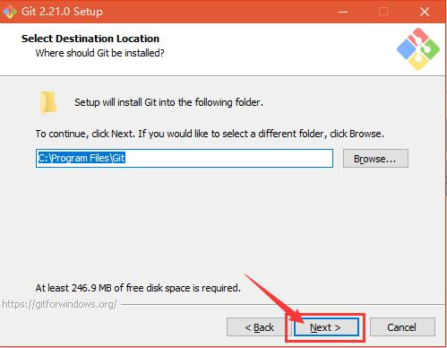
4. 取消`Git GUI Here`的勾选
* 点击`Next`按钮，如下图红色箭头标记处所示：
* 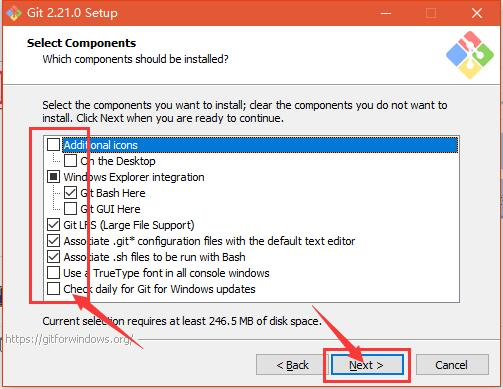
5. 点击`Next`按钮，如下图红色箭头标记处所示：
* 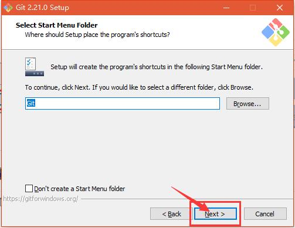
6. 点击`Next`按钮，如下图红色箭头标记处所示：
* 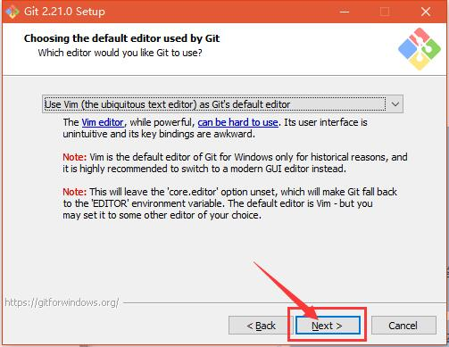
7. 选择`Git from the command line and also from 3rd-party software`
* 点击`Next`按钮，如下图红色箭头标记处所示：
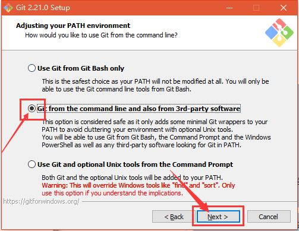
8. 选择`Use the OpenSSL library`
* 点击`Next`按钮，如下图红色箭头标记处所示：
* 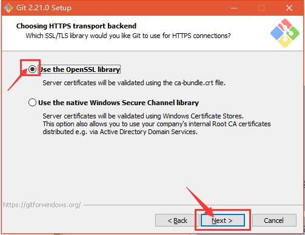
9. 选择`Checkout Windows-style, commit Unix-style line endings`
* 如图中红色下划线所示，When Commiting text files, CRLF will be converted to LF，翻译为中文：当提交文本文件时，CRLF符号将被转换为LF符号。
* 这两个符号会造成Windows系统和Linux系统的兼容问题，作者曾经花费1小时解决此兼容问题，所以对此有所体会。理解CRLF和LF看这2篇文章：
9.1. [话说Git来管控CRLF和LF混乱局面](https://www.jianshu.com/p/684d94caebfe)
9.2. [解决crlf 和 lf不同带来的冲突问题][https://www.cnblogs.com/kugeliu/p/9154021.html]
10. 点击`Next`按钮，如下图红色箭头标记处所示：
* 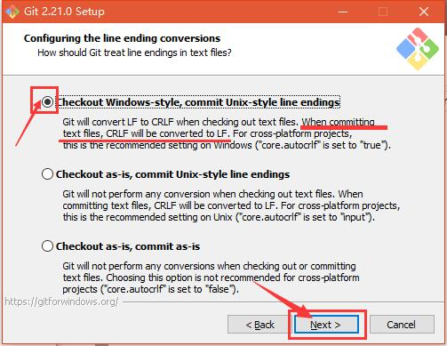
11. 点击`Next`按钮，如下图红色箭头标记处所示：
* 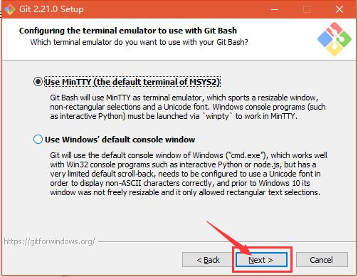
12. 点击`Next`按钮，如下图红色箭头标记处所示：
* 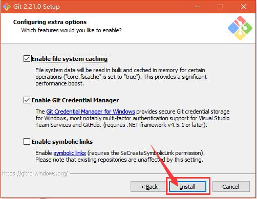
13. 软件开始安装，安装过程截图如下图所示：
* 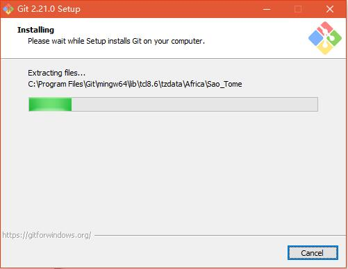
14. 取消勾选`View Release Notes`
* 点击`Finish`按钮，如下图红色箭头标记处所示：
* 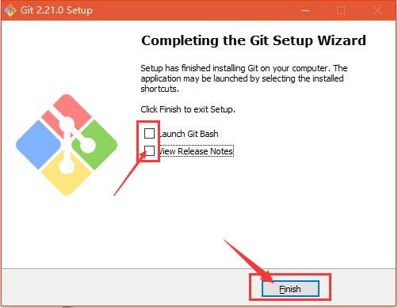
