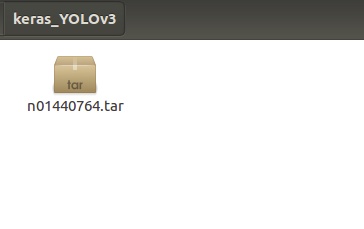

# 目标检测实践_Keras版YOLOv3训练自己的数据
这篇文章介绍了如何使用Keras版YOLOv3训练自己的数据，搭配大量的图片和说明。

## 致谢声明
1. 本文学习`Patrick_Lxc`的博客《[Keras/Tensorflow+python+yolo3训练自己的数据集](https://blog.csdn.net/Patrick_Lxc/article/details/80615433)》并优化其中代码。
2. 本文学习`qqwweee`的github工程《[keras-yolo3](https://github.com/qqwweee/keras-yolo3)》并优化其中代码。

## 配置代码运行环境
### 硬件配置要求
* YOLOv3对于电脑的显卡要求高，根据本文作者的经验，至少需要8GB的显存才能继续本文下面的实验。
* 只有Nvidia品牌的显卡可以运行深度学习，AMD品牌的显卡不可以运行深度学习。
* 那么Nvidia品牌具有8GB显存的最低价格显卡的型号为GTX1070。
* 2019年2月28日查询，京东上原装GTX1070的价格为2800元左右。
* 2019年2月28日查询，淘宝上网吧二手拆机显卡GTX1070的价格为1800元左右。
* 如果购买资金充足，建议购买GTX1080Ti，11G显存可以运行准确率更高的YOLOv3-spp算法模型。
* 如果购买资金不足，最少也得购买GTX1070，否则无法继续本文下面的实验。

### 软件配置要求
各种软件版本：
* Ubuntu ：16.04
* Anaconda ：5.2
* python ： 3.6
* CUDA ：9.0
* cudnn ：7.3
* tensorflow_gpu ：1.10
* Keras ：2.2.4
* 如果有显存为8G的显卡，在Windows操作系统下也**无法运行**本文下面的代码。会报错"显存不足"。
* 所以读者需要安装Ubuntu操作系统，建议选择Ubuntu16.04，制作系统U盘后非常容易安装。
* 如果有显存为11G的显卡，在Windows操作系统下可以继续本文下面的实验。
* 有显卡之后需要配置深度学习环境，请阅读我的另一篇文章《[深度学习环境搭建-CUDA9.0、cudnn7.3、tensorflow_gpu1.10的安装](https://www.jianshu.com/p/4ebaa78e0233)》

## 1.数据准备
### 1.1 数据下载
* 如果读者有自己已经使用labelImg软件标注好的数据，可以直接跳到1.4节图片压缩。
* 本文作者给读者演示的图片数据是来自ImageNet中的鲤鱼分类。数据集压缩文件`n01440764.tar`下载链接: https://pan.baidu.com/s/1NksESNqBX--YqMJ4zptGdw 提取码: 6p3u
* 本文作者在桌面中创建文件夹`keras_YOLOv3`，并将下载好的数据集压缩文件`n01440764.tar`放到其中，如下图所示：


在文件夹`keras_YOLOv3`中鼠标右击，在显示的菜单中选择`Open in Terminal`，即在文件夹`keras_YOLOv3`中打开Terminal。
作为合格的Ubuntu系统使用者，要求会使用终端Terminal中的命令完成操作。
运行命令`mkdir n01440764`创建文件夹`n01440764`。
运行命令`tar -xvf n01440764.tar -C n01440764`完成压缩文件的解压，命令其中的-C参数后面必须为已经存在的文件夹，否则运行命令会报错。
解压完成后，文件夹和终端Terminal中的情况如下图所示：


### 1.2 在Ubuntu中安装软件labelImg
需要使用软件labelImg做图片的数据标注。
软件labelImg的下载地址：https://github.com/tzutalin/labelImg，页面如下图所示：

在文件夹`keras_YOLOv3`中打开Terminal，运行下列命令：
1.加快apt-get命令的下载速度，需要做Ubuntu系统的换源。方法如下：
在Ubuntu的设置Settings中选择`Software & Updates`，将Download from的值设置为`http://mirrors.aliyun.com/ubuntu`，如下图所示：

2.运行命令`wget https://codeload.github.com/tzutalin/labelImg/zip/master -O labelImg-master.zip`从github上下载labelImg的源码压缩文件。
3.运行命令`unzip labelImg-master.zip`完成压缩文件的解压。
4.运行命令`sudo apt-get install pyqt5-dev-tools`安装软件pyqt5-dev-tools。
5.运行命令`cd labelImg-master`进入文件夹labelImg-master。
6.运行命令`pip install -r requirements/requirements-linux-python3.txt`安装软件labelImg运行时需要的库，如果已经安装Anaconda此步可能不用进行。如果pip下载库的速度慢，请查看我的另外一篇文章《pip换源》，
链接：https://www.jianshu.com/p/46c17698bd4b
7.运行命令`make qt5py3`编译产生软件labelImg运行时需要的组件。
8.运行命令`python labelImg.py`运行代码文件labelImg.py，运行结果如下图所示：


### 1.3 获取像素足够的图片
因为文件夹`n01440764`中有一部分图片像素不足416 * 416，不利于模型训练，所以本节内容有必要进行。
新建一个代码文件generate_qualified_images.py或generate_qualified_images.ipynb，将下面一段代码复制到其中。
运行代码可以完成2个功能：
1.可以选取文件夹`n01440764`中的200张像素足够的图片；
2.将选取的图片复制到在新文件夹`selected_images`中。
```python
import os
import random
from PIL import Image
import shutil

# 获取文件夹中的文件路径
def getFilePathList(dirPath, partOfFileName=''):
    allFileName_list = list(os.walk(dirPath))[0][2]
    fileName_list = [k for k in allFileName_list if partOfFileName in k]
    filePath_list = [os.path.join(dirPath, k) for k in fileName_list]
    return filePath_list

# 获取一部分像素足够，即长，宽都大于416的图片
def generate_qualified_images(dirPath, sample_number, new_dirPath):
    jpgFilePath_list = getFilePathList(dirPath, '.JPEG')
    random.shuffle(jpgFilePath_list)
    if not os.path.isdir(new_dirPath):
        os.makedirs(new_dirPath)
    i = 0
    for jpgFilePath in jpgFilePath_list:
        image = Image.open(jpgFilePath)
        width, height = image.size
        if width >= 416 and height >= 416:
            i += 1
            new_jpgFilePath = os.path.join(new_dirPath, '%03d.jpg' %i)
            shutil.copy(jpgFilePath, new_jpgFilePath)
        if i == sample_number:
            break

# 获取数量为100的合格样本存放到selected_images文件夹中
generate_qualified_images('n01440764', 200, 'selected_images')
```

### 1.4 数据标注 
数据标注是一件苦力活，本文作者标记200张图片花费90分钟左右。
本节演示单张图片的标注。
如下图红色箭头标记处所示，打开数据集文件夹。

如下图红色箭头标记处所示，选择文件夹`keras_YOLOv3`中的文件夹`selected_images`，选中后点击如下图下方红色箭头标记处所示的Choose按钮。

如下图红色箭头标记处所示，给这张图标记了2个物体：人脸human_face、鱼fish
在软件labelImg界面中，按w键即可开始标记物体。

本文作者标注好200张图片，上传到百度云盘，便于读者直接复现。
下载链接: https://pan.baidu.com/s/1-bZ5B5JKFB7R6aWUPBdP_w 提取码: 9rjg


### 1.5 检查标注数据
新建一个代码文件check_annotations.py或check_annotations.ipynb，将下面一段代码复制到其中。
运行代码可以完成2个功能：
1.检查代码检查标记好的文件夹是否有图片漏标
2.检查标记的xml文件中是否有物体标记类别拼写错误
```python
#获取文件夹中的文件路径
import os
def getFilePathList(dirPath, partOfFileName=''):
    allFileName_list = list(os.walk(dirPath))[0][2]
    fileName_list = [k for k in allFileName_list if partOfFileName in k]
    filePath_list = [os.path.join(dirPath, k) for k in fileName_list]
    return filePath_list

#此段代码检查标记好的文件夹是否有图片漏标
def check_1(dirPath):
    jpgFilePath_list = getFilePathList(dirPath, '.jpg')
    allFileMarked = True
    for jpgFilePath in jpgFilePath_list:
        xmlFilePath = jpgFilePath[:-4] + '.xml'
        if not os.path.exists(xmlFilePath):
            print('%s this picture is not marked.' %jpgFilePath)
            allFileMarked = False
    if allFileMarked:
        print('congratulation! it is been verified that all jpg file are marked.')

#此段代码检查标记的xml文件中是否有物体标记类别拼写错误        
import xml.etree.ElementTree as ET
def check_2(dirPath, className_list):
    className_set = set(className_list)
    xmlFilePath_list = getFilePathList(dirPath, '.xml')
    allFileCorrect = True
    for xmlFilePath in xmlFilePath_list:
        with open(xmlFilePath) as file:
            fileContent = file.read()
        root = ET.XML(fileContent)
        object_list = root.findall('object')
        for object_item in object_list:
            name = object_item.find('name')
            className = name.text
            if className not in className_set:
                print('%s this xml file has wrong class name "%s" ' %(xmlFilePath, className))
                allFileCorrect = False
    if allFileCorrect:
        print('congratulation! it is been verified that all xml file are correct.')

if __name__ == '__main__':
    dirPath = 'selected_images'
    className_list = ['fish', 'human_face']
    check_1(dirPath)
    check_2(dirPath, className_list)
```

### 1.6 图像压缩
预先压缩好图像，模型训练时不用再临时改变图片大小，或许可以加快模型训练速度。
新建一个代码文件compress_images.py或compress_images.ipynb，将下面一段代码复制到其中。
运行代码可以完成2个功能：
1.将旧文件夹中的jpg文件压缩后放到新文件夹中。
2.将旧文件夹中的jpg文件对应的xml文件修改后放到新文件夹中。
```python
#获取文件夹中的文件路径
import os
def getFilePathList(dirPath, partOfFileName=''):
    allFileName_list = list(os.walk(dirPath))[0][2]
    fileName_list = [k for k in allFileName_list if partOfFileName in k]
    filePath_list = [os.path.join(dirPath, k) for k in fileName_list]
    return filePath_list

#生成新的xml文件
import xml.etree.ElementTree as ET
def generateNewXmlFile(old_xmlFilePath, new_xmlFilePath, new_size):
    new_width, new_height = new_size
    with open(old_xmlFilePath) as file:
        fileContent = file.read()
    root = ET.XML(fileContent)
    #获得图片宽度变化倍数，并改变xml文件中width节点的值
    width = root.find('size').find('width')
    old_width = int(width.text)
    width_times = new_width / old_width
    width.text = str(new_width)
    #获得图片高度变化倍数，并改变xml文件中height节点的值
    height = root.find('size').find('height')
    old_height = int(height.text)
    height_times = new_height / old_height
    height.text = str(new_height)
    #获取标记物体的列表，修改其中xmin,ymin,xmax,ymax这4个节点的值
    object_list = root.findall('object')
    for object_item in object_list:
        bndbox = object_item.find('bndbox')
        xmin = bndbox.find('xmin')
        xminValue = int(xmin.text)
        xmin.text = str(int(xminValue * width_times))
        ymin = bndbox.find('ymin')
        yminValue = int(ymin.text)
        ymin.text = str(int(yminValue * height_times))
        xmax = bndbox.find('xmax')
        xmaxValue = int(xmax.text)
        xmax.text = str(int(xmaxValue * width_times))
        ymax = bndbox.find('ymax')
        ymaxValue = int(ymax.text)
        ymax.text = str(int(ymaxValue * height_times))
    tree = ET.ElementTree(root)
    tree.write(new_xmlFilePath)
    
#修改文件夹中的若干xml文件
def batch_modify_xml(old_dirPath, new_dirPath, new_size):
    xmlFilePath_list = getFilePathList(old_dirPath, '.xml')
    for xmlFilePath in xmlFilePath_list:
        xmlFileName = os.path.split(xmlFilePath)[1]
        new_xmlFilePath = os.path.join(new_dirPath, xmlFileName)
        generateNewXmlFile(xmlFilePath, new_xmlFilePath, new_size)
        
#生成新的jpg文件
from PIL import Image
def generateNewJpgFile(old_jpgFilePath, new_jpgFilePath, new_size):
    old_image = Image.open(old_jpgFilePath)
    new_image = old_image.resize(new_size, Image.ANTIALIAS)
    new_image.save(new_jpgFilePath)
    
#修改文件夹中的若干jpg文件
def batch_modify_jpg(old_dirPath, new_dirPath, new_size):
    if not os.path.isdir(new_dirPath):
        os.makedirs(new_dirPath)
    xmlFilePath_list = getFilePathList(old_dirPath, '.xml')
    for xmlFilePath in xmlFilePath_list:
        old_jpgFilePath = xmlFilePath[:-4] + '.jpg'
        jpgFileName = os.path.split(old_jpgFilePath)[1]
        new_jpgFilePath = os.path.join(new_dirPath, jpgFileName)
        generateNewJpgFile(old_jpgFilePath, new_jpgFilePath, new_size)
        
if __name__ == '__main__':
    old_dirPath = 'selected_images'
    new_width = 416
    new_height = 416
    new_size = (new_width, new_height)
    new_dirPath = 'images_%sx%s' %(str(new_width), str(new_height))
    batch_modify_jpg(old_dirPath, new_dirPath, new_size)
    batch_modify_xml(old_dirPath, new_dirPath, new_size)
```
标注好的200张压缩后的图片，上传到百度云盘，便于读者直接复现。
链接: https://pan.baidu.com/s/1WvLW0xK-1tIQpgxqnigPng 提取码: 24ix

## 2.模型训练
### 2.1 下载github上的代码库
下载github上的代码库，链接：https://github.com/StevenLei2017/keras-yolo3
下载操作如下图所示，点击图中的`Download ZIP`：

压缩文件`keras-yolo3-master.zip`移动到文件夹`keras_YOLOv3`中。
运行命令`unzip keras-yolo3-master.zip`完成压缩文件的解压。
上面2步完成后，文件夹`keras_YOLOv3`中示意图如下：


### 2.2 划分训练集和测试集
1.将文件夹`images_416*416`移动到文件夹`keras-yolo3-master`中，如下图所示：

2.打开文件夹`keras-yolo3-master`中的文件夹`model_data`，编辑其中的文件`voc_names.txt`。
文件`voc_names.txt`中每1行代表1个类别。
3.文件夹`keras-yolo3-master`中打开终端Terminal，然后运行命令`python generateTxtFile.py -dir images_416*416`会划分训练集和测试集，并产生与之对应的文本文件。
训练集文件`dataset_train.txt`，测试集文件`dataset_test.txt`，如下图所示：


### 2.3 开始训练
文件夹`keras-yolo3-master`中打开终端Terminal，然后运行命令`python train.py`即可开始训练。
训练过程如下图所示：
本文作者的显卡为Nvidia RTX2070，从图中下方红色方框处可以看出每个epoch需要大约15秒，则200个epoch约1个小时能够运行完成。

本篇文章模型训练需要较长时间，建议读者将2.3节的内容放到晚上运行。
调整模型训练的轮次epochs需要修改代码文件`train.py`的第85行fit_generator方法中的参数，即第90行参数epochs的值。

## 3.模型测试
本文作者训练一晚上，epoch数值为2500，已经训练好的模型权重文件上传到百度网盘。
如果读者没有完成模型训练，可以先下载本文作者已经训练好的模型权重文件完成本章内容。
链接: https://pan.baidu.com/s/1FhaJvQxxMDq_vTIkro8cHg 提取码: qmrf
压缩文件`fish_weights.zip`解压后，将文件`trained_weights.h5`放到文件夹`saved_model`中。
### 3.1 单张图片目标检测
文件夹`keras-yolo3-master`中打开终端Terminal，
然后运行命令`jupyter notebook`，浏览器会自动打开并访问jupyter页面。
在jupyter页面打开代码文件`yolo_test.ipynb`，依次运行代码块即可。
第1个代码块加载YOLOv3模型；
第2个代码块加载测试集文本文件`dataset_test.txt`，并取出其中的图片路径赋值给变量jpgFilePath_list；
第3个代码块是根据图片路径打开图片后，调用YOLO对象的detect_image方法对图片做目标检测。
运行结果如下图所示：


### 3.2 视频目标检测
#### 3.2.1 将图片合成为1部视频
文件夹`keras-YOLOv3`中打开终端Terminal，运行命令`sudo apt-get install ffmpeg`安装软件ffmpeg。
安装成功如下图所示：

继续在此Terminal中运行命令`ffmpeg -start_number 1 -r 1 -i images_416x416/%03d.jpg -vcodec mpeg4 keras-yolo3-master/1.mp4`，请读者确保当前Terminal所在目录中有文件夹`images_416x416`。
ffmpeg命令参数解释：
1.-start_number，配合参数-i使用，默认为0，表示%03d索引开始的数字；
2.-r，表示视频的帧数，即一秒取多少张图片制作视频；
3.-i，input的简写，表示制作视频的图片路径；
4.-vcodec，视频编码格式，mpeg4为常用的视频编码。
5.命令的最后，是输出文件路径，本例中keras-yolo3-master/1.mp4即保存视频到文件夹`keras-yolo3-master`中，并命名为1.mp4。
运行结果如下图所示：


#### 3.2.2 调用代码文件yolo_video.py
继续在此Terminal中运行命令`pip install opencv-python`，安装opencv-python库。
继续在此Terminal中运行命令`cd keras-yolo3-master`，进入文件夹`keras-yolo3-master`。
继续在此Terminal中运行命令`python yolo_video.py --input 1.mp4 --output fish_output.mp4`，表示对视频文件`1.mp4`做目标检测，并将检测结果保存为视频文件`fish_output.mp4`。
YOLOv3模型速度很快，在本案例中检测1张图片只需要0.05秒。
制作视频时每秒设置为1帧，即每秒1张图片。如果不人为干预，完成1帧图片的目标检测后立即开始下1帧，速度过快，人眼看不清楚。
本文作者修改了代码文件`yolo.py`的第176行，使完成1帧的目标检测后停止0.5秒，这样视频的展示效果能够易于人眼接受。
本节实践的结果，视频输出文件`fish_output.mp4`上传到百度云盘。
链接: https://pan.baidu.com/s/1dQFcefhb3e-mnBWt-r-z3Q 提取码: yhxy 

### 3.3 多张图片目标检测
本节内容是将3.1节和3.2节内容结合起来，直接读取文件夹的若干图片做目标检测并展示为视频效果。
在文件夹`keras-yolo3-master`中新建一个代码文件`yolo_multiImages.py`，将下面一段代码复制到其中。
运行代码可以完成2个功能：
1.实时展示若干图片的目标检测结果；
2.将若干图片的检测结果保存为mp4格式的视频文件。
```python
from yolo import YOLO
from PIL import Image
import os
import cv2
import time
import numpy as np
#获取文件夹中的文件路径
def getFilePathList(dirPath, partOfFileName=''):
    allFileName_list = list(os.walk(dirPath))[0][2]
    fileName_list = [k for k in allFileName_list if partOfFileName in k]
    filePath_list = [os.path.join(dirPath, k) for k in fileName_list]
    return filePath_list

def detectMultiImages(modelFilePath, jpgFilePath_list, out_mp4FilePath=None):
    yolo_model = YOLO(model_path=modelFilePath)
    cv2.namedWindow('result', cv2.WINDOW_NORMAL)
    width = 1000
    height = 618
    size = (width, height)
    cv2.resizeWindow('result', width, height)
    if out_mp4FilePath is not None:
        fourcc = cv2.VideoWriter_fourcc('M', 'P', 'E', 'G')
        videoWriter = cv2.VideoWriter(out_mp4FilePath, fourcc, 1.7, size)
    for jpgFilePath in jpgFilePath_list:
        image = Image.open(jpgFilePath)
        out_image = yolo_model.detect_image(image)
        resized_image = out_image.resize(size, Image.ANTIALIAS)
        resized_image_ndarray = np.array(resized_image)
        #图片第1维是宽，第2维是高，第3维是RGB
        #PIL库图片第三维是RGB，cv2库图片第三维正好相反，是BGR
        cv2.imshow('result', resized_image_ndarray[...,::-1])
        time.sleep(0.3)
        if out_mp4FilePath is not None:
            videoWriter.write(resized_image_ndarray[...,::-1])
        if cv2.waitKey(1) and 0xFF == ord('q'):
            break
    yolo_model.close_session()
    cv2.destroyAllWindows()


if __name__ == '__main__':
    modelFilePath = 'saved_model/trained_weights.h5'
    dirPath = '../n01440764'
    out_mp4FilePath = 'fish_output_2.mp4'
    jpgFilePath_list = getFilePathList(dirPath, '.JPEG')
    detectMultiImages(modelFilePath, jpgFilePath_list, out_mp4FilePath)
```
本节实践的结果，视频输出文件`fish_output_2.mp4`上传到百度云盘。
这是用180张图片作为训练集，在1000张同类型图片上的模型测试结果。
链接: https://pan.baidu.com/s/16d-iHLDXvLbs6jy_JQQ3kw 提取码: x14y

## 4.总结
* 1.本文作者根据1个多月YOLOv3的工作经验，花费3天完成本篇文章的写作，非常易于新手展开目标检测框架YOLOv3的实践。
* 2.本篇文章的代码集成性强，当读者做好数据准备后，只需要很短的时间即可开始模型训练。
* 3.本文作者为了学习原作者`qqwweee`的代码，在原作者代码的基础上重新编辑并添加了中文注释，保证模型性能的同时删除了原作者代码中的以下功能：对YOLOv3_tiny的支持、检测时对多GPU的支持。
4.读者可以先从本文作者已经精简的代码入手，推荐阅读以下5个代码文件：
文件夹`keras_yolo3-master`中的`generateTxtFile.py`可以生成训练集，测试集文本文件；
文件夹`keras_yolo3-master`中的`train.py`可以开始模型训练；
文件夹`keras_yolo3-master`中的`yolo.py`可以实例化YOLO对象用于模型测试；
文件夹`keras_yolo3-master/yolo3`中的`model.py`是YOLOv3算法原理的实现；
文件夹`keras_yolo3-master/yolo3`中的`utils.py`类似于工程中的工具包，将YOLOv3算法工程的部分封装函数一起写在里面。
