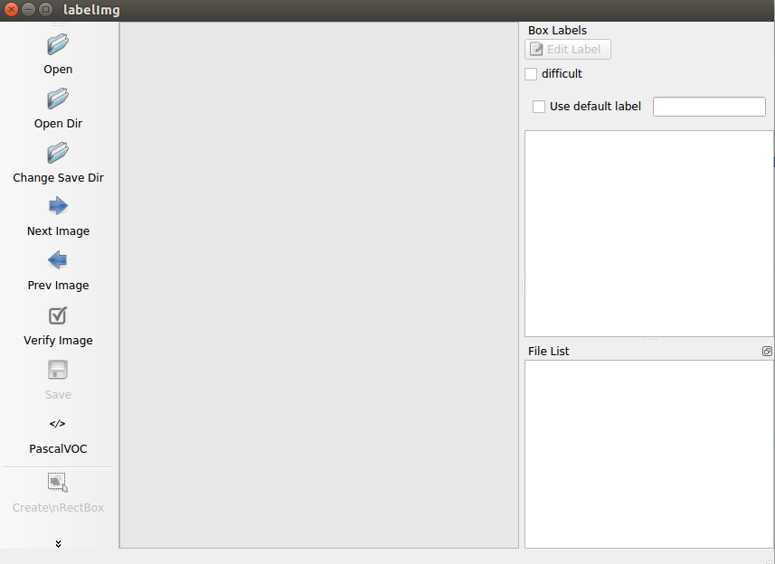
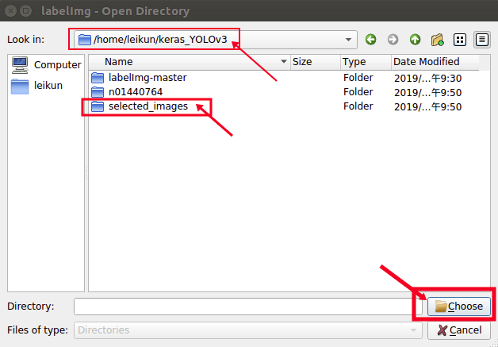
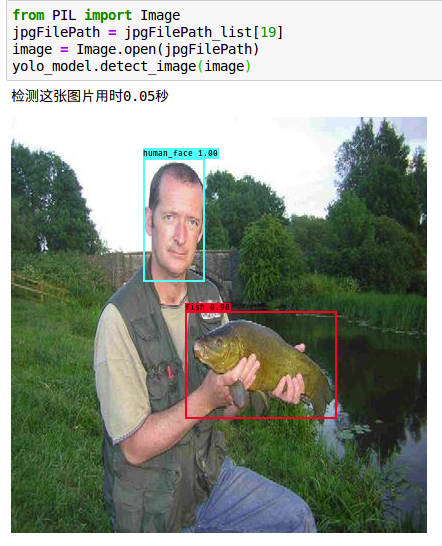
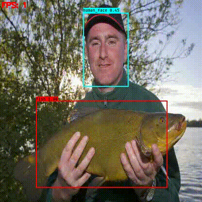
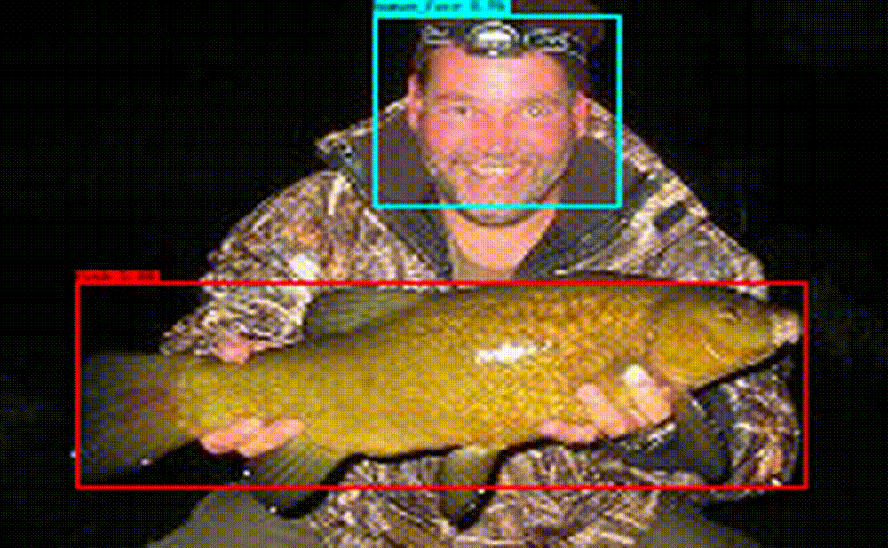

# 目标检测实践_Keras版YOLOv3训练自己的数据
* 这篇文章介绍了如何使用Keras版YOLOv3训练自己的数据，搭配大量的图片和说明。
* 如果读者需要训练自己的数据，需要修改以下内容：
1. 运行python命令使用的各项参数，包括：文件夹路径、图片宽高、图片文件后缀名等
2. 文件`resources/className_list.txt`中的类别名称，每1行表示1个类别

## 致谢
1. 本文学习`qqwweee`的github工程《[keras-yolo3](https://github.com/qqwweee/keras-yolo3 )》并优化其中代码。
2. 本文学习`Patrick_Lxc`的博客《[Keras/Tensorflow+python+yolo3训练自己的数据集](https://blog.csdn.net/Patrick_Lxc/article/details/80615433 )》并优化其中代码。

## 配置代码运行环境
### 硬件配置要求
* YOLOv3对于电脑的显卡要求高，根据本文作者的经验，至少需要8GB的显存才能继续本文下面的实验。
* 只有Nvidia品牌的显卡可以运行深度学习，**AMD品牌的显卡不可以运行深度学习**。
* 那么Nvidia品牌具有8GB显存的最低价格显卡的型号为GTX1070。
* 2019年2月28日查询，京东上原装GTX1070的价格为2800元左右。
* 2019年2月28日查询，淘宝上网吧二手拆机显卡GTX1070的价格为1800元左右。
* 如果购买资金充足，建议购买GTX1080Ti，11G显存可以运行准确率更高的YOLOv3-spp算法模型。
* 如果购买资金不足，最少也得购买GTX1070，否则无法继续本文下面的实验。

### 软件配置要求
各种软件版本：
* Ubuntu ：16.04
* Anaconda ：5.2
* python ： 3.6
* CUDA ：9.0
* cudnn ：7.3
* tensorflow_gpu ：1.10
* Keras ：2.2.4
* 如果有显存为8G的显卡，在Windows操作系统下也**无法运行**本文下面的代码。会报错"显存不足"。
* 所以读者需要安装Ubuntu操作系统，建议选择Ubuntu16.04，制作系统U盘后非常容易安装。
* 如果有显存为11G的显卡，在Windows操作系统下可以继续本文下面的实验。
* 有显卡之后需要配置深度学习环境，请阅读我的另一篇文章《[深度学习环境搭建-CUDA9.0、cudnn7.3、tensorflow_gpu1.10的安装](https://www.jianshu.com/p/4ebaa78e0233)》

## 1.数据准备

### 1.1 下载资源
* 阅读[resources/readme.md](resources/)，并完成其中内容。
* 如果读者有自己已经使用labelImg软件标注好的数据，可以直接跳到1.5节`检查标注文件`。
* 本文作者给读者演示的图片数据是来自ImageNet中的鲤鱼分类，对应数据集文件夹`resources/n01440764`

### 1.2 在Ubuntu中安装软件labelImg
需要使用软件labelImg做图片的数据标注，软件labelImg所在文件夹路径：`resources/labelImg-master`
1. 加快apt-get命令的下载速度，需要做Ubuntu系统的换源。方法如下：
    * 在Ubuntu的设置Settings中选择`Software & Updates`，将Download from的值设置为`http://mirrors.aliyun.com/ubuntu`，如下图所示：
    
2. 在文件夹`resources/labelImg-master`中打开Terminal
3. Terminal运行命令`sudo apt-get install pyqt5-dev-tools`安装软件pyqt5-dev-tools。
4. Terminal运行命令`pip install -r requirements/requirements-linux-python3.txt`安装软件labelImg运行时需要的库。
    * 如果pip下载库的速度慢，请查看我的另外一篇文章《[pip换源](https://www.jianshu.com/p/46c17698bd4b )》
5. Terminal运行命令`make qt5py3`编译产生软件labelImg运行时需要的组件。
6. Terminal运行命令`python labelImg.py`运行代码文件labelImg.py，运行结果如下图所示：
    

### 1.3 选出像素足够的图片
* 原始图片数据文件夹`resources/n01440764`中有大多数图片像素低于416x416，像素低的图片不利于模型的学习，所以需要选出像素足够的图片。
* 使用代码文件`code/_01_select_images.py`选出像素足够的图片。
1. 在文件夹`code`中打开Terminal
2. Terminal运行命令`python _01_select_images.py`

### 1.4 数据标注 
* 数据标注是一件苦力活，本文作者标记200张图片花费90分钟左右。
* 本节演示单张图片的标注，如下图红色箭头标记处所示，首先点击`Open Dir`

* 选中图片文件所在的文件夹，选中后点击下图下方红色箭头标记处所示的Choose按钮，则软件labelImg加载图片。

* 在软件labelImg界面中，按w键即可开始标注物体。
* 如下图红色箭头标记处所示，给这张图标注了2个物体：人脸human_face、鱼fish

* 本文作者标注好200张图片，在文件夹`resources/selected_images`

### 1.5 检查标注文件
* 使用代码文件`code/_02_check_labels.py`检查标注文件。
1. 在文件夹`code`中打开Terminal
2. Terminal运行命令`python _02_check_labels.py`

### 1.6 压缩图像大小
* 预先改变图像大小，模型训练时不用临时改变图片大小，可以加快模型训练速度、提高模型准确率。
* 使用代码文件`code/_03_compress_images`压缩图像大小
1. 在文件夹`code`中打开Terminal
2. Terminal运行命令`python _03_compress_images.py -d ../resources/selected_images`

## 2.模型训练

### 2.1 划分训练集和测试集
1. 编辑类别名称列表文件`resources/className_list.txt`，每1行表示1个类别。
* 使用代码文件`code/_04_generate_txtFile.py`划分训练集和测试集，并产生与之对应的文本文件：
* 训练集文件`dataset_train.txt`，测试集文件`dataset_test.txt`
2. 在文件夹`code`中打开Terminal
3. Terminal运行命令`python _04_generate_txtFile.py -d ../resources/images_416x416`

### 2.2 开始训练
* 使用代码文件`code/_05_train.py`开始训练
1. 在文件夹`code`中打开Terminal
2. Terminal运行命令`python _05_train.py`
* 本文作者的显卡为Nvidia RTX2070，从图中下方红色方框处可以看出每个epoch需要大约15秒，则200个epoch约1个小时能够运行完成。

* 本篇文章模型训练需要较长时间，建议读者将epoch设置为2000后，放到晚上运行。
调整模型训练的轮次epochs需要修改代码文件`train.py`的第85行fit_generator方法中的参数，即第90行参数epochs的值。

## 3.模型测试
本文作者训练一晚上，epoch数值为2500，已经训练好的模型权重文件`resources/trained_weights.h5`
### 3.1 单张图片目标检测
* 使用代码文件`code/_07_yolo_test.ipynb`开始训练
1. 在文件夹`code`中打开Terminal
2. Terminal运行命令`jupyter notebook`，浏览器会自动打开并访问jupyter页面。
3. 在jupyter页面打开代码文件`_07_yolo_test.ipynb`，依次运行代码块即可。
    * 第1个代码块加载YOLOv3模型；
    * 第2个代码块加载测试集文本文件`dataset_test.txt`，并取出其中的图片路径赋值给变量jpgFilePath_list；
    * 第3个代码块是根据图片路径打开图片后，调用YOLO对象的detect_image方法对图片做目标检测。
* 运行结果如下图所示：
* 

### 3.2 视频目标检测

#### 3.2.1 将图片合成为1部视频
1. 在文件夹`resources`中打开Terminal
2. 在Terminal运行命令`sudo apt-get install ffmpeg`安装软件ffmpeg
    * 安装软件ffmpeg成功如下图所示：
    
3. 继续在此Terminal中运行命令`ffmpeg -start_number 1 -r 1 -i images_416x416/%03d.jpg -vcodec mpeg4 ./1.mp4`，请读者确保当前Terminal所在目录中有文件夹`images_416x416`。
* ffmpeg命令参数解释：
    * 1.-start_number，配合参数-i使用，默认为0，表示%03d索引开始的数字；
    * 2.-r，表示视频的帧数，即一秒取多少张图片制作视频；
    * 3.-i，input的简写，表示制作视频的图片路径；
    * 4.-vcodec，视频编码格式，mpeg4为常用的视频编码。
    * 5.命令的最后，是输出文件路径
* 运行结果如下图所示：

#### 3.2.2 调用代码文件yolo_video.py
* 使用代码文件`code/yolo_video.py`做视频的目标检测
1. 在文件夹`code`中打开Terminal
2. Terminal中运行命令`pip install opencv-python`，安装opencv-python库。
3. Terminal中运行命令`python yolo_video.py --input ../resources/1.mp4 --output ../resources/fish_output.avi`，表示对视频文件`1.mp4`做目标检测，并将检测结果保存为视频文件`fish_output.avi`。
* YOLOv3模型的检测速度很快，在本案例中检测1张图片只需要0.05秒。
* 如果不人为干预，完成1帧图片的目标检测后立即开始下1帧，速度过快，人眼看不清楚。
* 代码文件`_06_yolo.py`的第183行，使完成1帧的目标检测后停止0.5秒，这样检测结果动画的速度能够易于人眼接受。
* 视频检测的动画效果如下图所示：

### 3.3 多张图片目标检测
* 本节内容是将3.1节和3.2节内容结合起来，直接读取文件夹的若干图片做目标检测并展示为视频效果。
* 运行代码可以完成2个功能：
1. 动画展示若干图片的目标检测结果；
2. 将若干图片的检测结果保存为avi格式的视频文件。
* 这是用180张图片作为训练集，在1000张同类型图片上的模型测试结果。
* 使用代码文件`code/_08_detect_multi_images.py`做多张图片的目标检测
1. 在文件夹`code`中打开Terminal
2. Terminal中运行命令`python _08_detect_multi_images.py`
* 多张图片检测的动画效果如下图所示：

## 4.总结
* 1.本文作者根据1个多月YOLOv3的工作经验，花费3天完成本篇文章的写作，非常易于新手展开目标检测框架YOLOv3的实践。
* 2.本篇文章的代码集成性强，当读者做好数据准备后，只需要很短的时间即可开始模型训练。
* 3.本文作者为了学习原作者`qqwweee`的代码，在原作者代码的基础上重新编辑并添加了中文注释，保证模型性能的同时删除了原作者代码中的以下功能：对YOLOv3_tiny的支持、检测时对多GPU的支持。
* 4.读者可以先从本文作者已经精简的代码入手，推荐阅读以下5个代码文件：
    * 文件夹`keras_yolo3-master`中的`generateTxtFile.py`可以生成训练集，测试集文本文件；
    * 文件夹`keras_yolo3-master`中的`train.py`可以开始模型训练；
    * 文件夹`keras_yolo3-master`中的`yolo.py`可以实例化YOLO对象用于模型测试；
    * 文件夹`keras_yolo3-master/yolo3`中的`model.py`是YOLOv3算法原理的实现；
    * 文件夹`keras_yolo3-master/yolo3`中的`utils.py`类似于工程中的工具包，将YOLOv3算法工程的部分封装函数一起写在里面。
