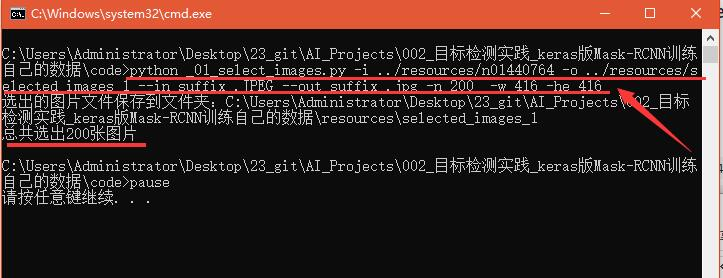
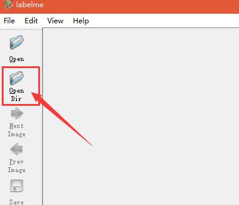
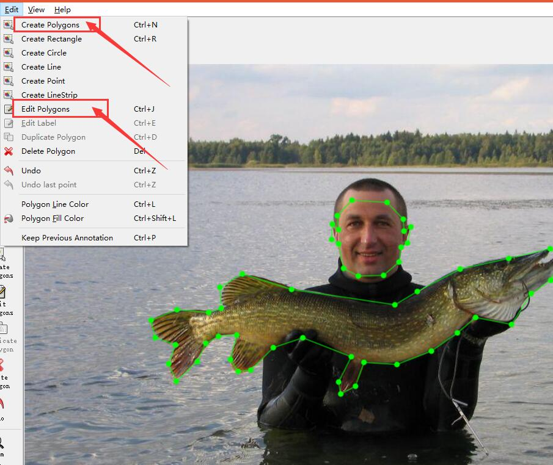
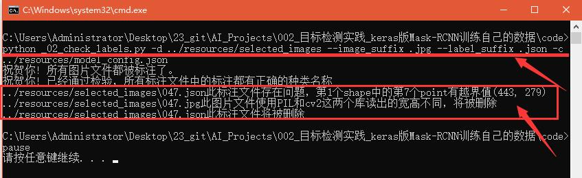
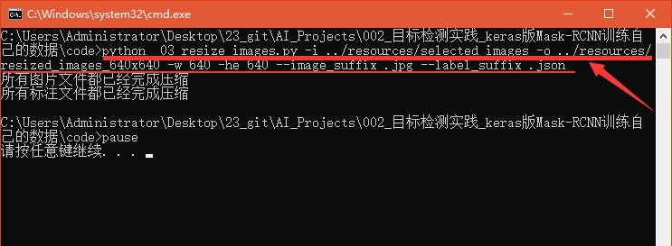
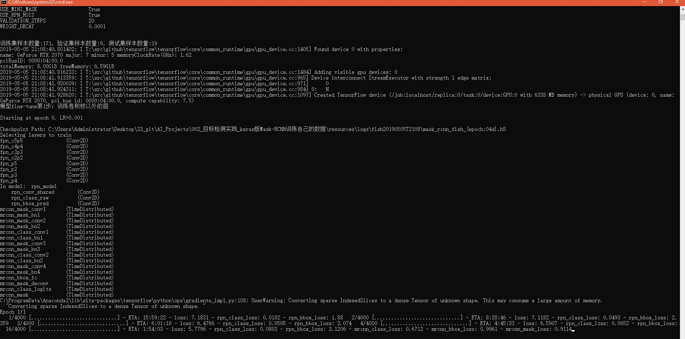
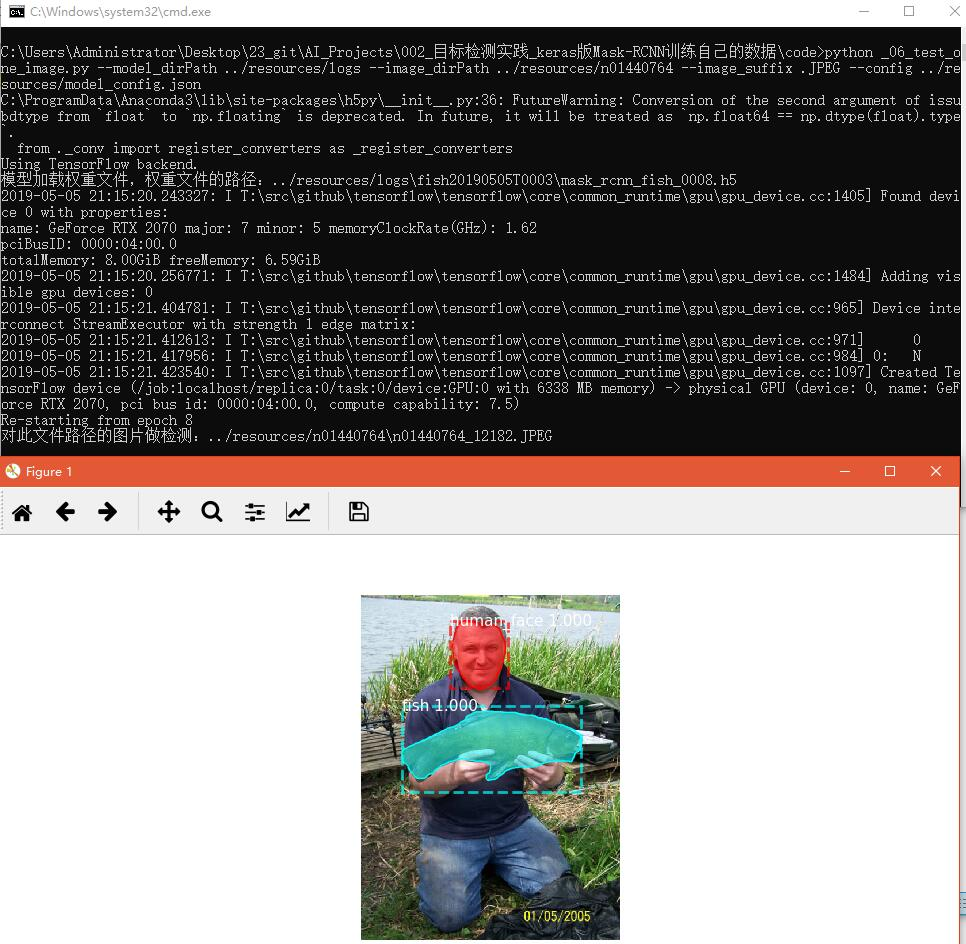
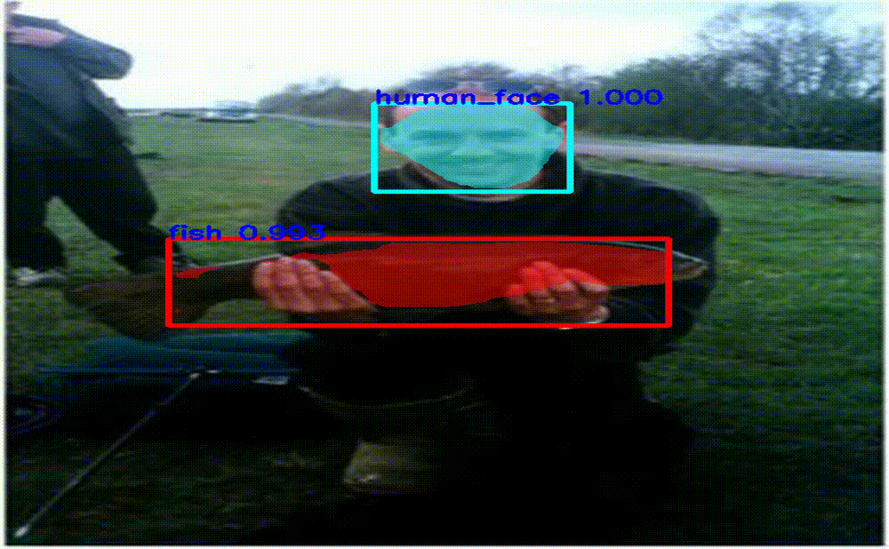
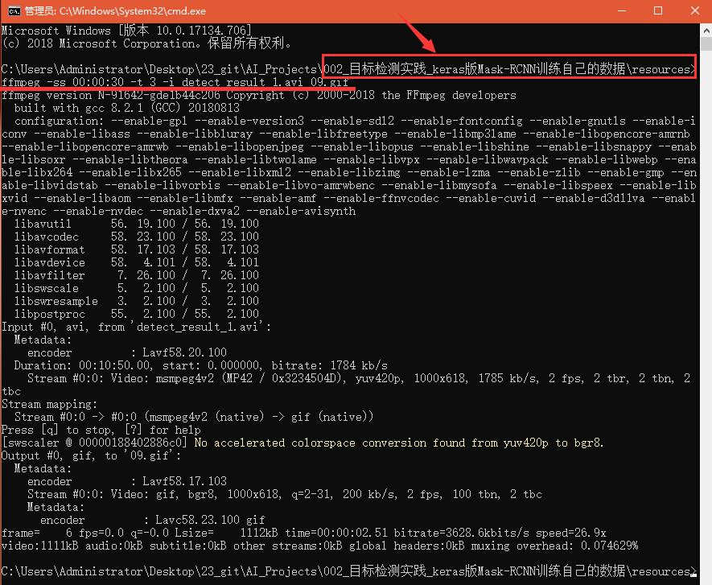

# 目标检测实践_Keras版Mask-RCNN训练自己的数据
* Mask-RCNN扩展性强，可完成目标检测、实例分割这2种功能。这篇文章介绍了如何使用Keras版Mask-RCNN训练自己的数据，搭配大量的图片和说明。
* 本实践教程的优点在于不需要使用命令labelme_json_to_dataset，而是使用json文件中的标注信息、cv2库的画图方法生成掩码。
* 本文详细介绍了作者是如何训练自己的数据，如果读者需要训练自己的数据，需要修改以下几个文件中的内容：
1. `resources/model_config.json`中的`className_list`
2. cmd命令脚本文件中的各项参数，包括：文件夹路径、图片宽高、图片文件后缀名等

## 致谢
1. 本文基于`matterport`的github工程《[Mask_RCNN](https://github.com/matterport/Mask_RCNN )》学习训练自己的数据。
2. 本文学习`一呆飞仙`的博客《[Mask RCNN训练自己的数据集](https://blog.csdn.net/l297969586/article/details/79140840 )》。
3. 本文学习`Oliver Cui`的博客《[mask rcnn训练自己的数据集](https://blog.csdn.net/qq_29462849/article/details/81037343 )》。
4. 本文学习`Jayce~`的博客《[Mask_RCNN训练自己的数据，制作类似于COCO数据集中所需要的Json训练集](https://blog.csdn.net/qq_15969343/article/details/80167215 )》。

## 配置代码运行环境
读者需要先保证自己能够运行`matterport`的github工程`Mask_RCNN`中的这2个代码文件，从而确保运行环境是可用的：
1. 文件路径为`samples/demo.ipynb`
2. 文件路径为`samples/shapes/train_shapes.ipynb`，从这个文件中可以学到如何训练一个最简单的数据集

### 硬件配置要求
* Mask-RCNN对于电脑的显卡要求高，根据本文作者的经验，至少需要6GB的显存才能继续本文下面的实验。
* 只有Nvidia品牌的显卡可以运行深度学习，AMD品牌的显卡不可以运行深度学习。
* 那么Nvidia品牌具有6GB显存的最低价格显卡的型号为GTX1060。
* 如果购买资金充足，建议购买GTX1080Ti，11G显存可以运行大batch-size、大像素分辨率的图片实验。
* 如果购买资金不足，最少也得购买GTX1060，否则无法继续本文下面的实验。

### 软件配置要求
各种软件版本：
* 操作系统 ：Windows10
* Anaconda ：5.2
* python ： 3.6
* CUDA ：9.0
* cudnn ：7.3
* tensorflow_gpu ：1.10
* Keras ：2.2.4。
* 有显卡之后需要配置深度学习环境，请阅读我的另一篇文章《[深度学习环境搭建-CUDA9.0、cudnn7.3、tensorflow_gpu1.10的安装](https://www.jianshu.com/p/4ebaa78e0233)》

## 1.数据准备

### 1.1 下载资源
* 阅读[resources/readme.md](resources/)，并完成其中内容。
* 如果读者有自己已经使用labelme软件标注好的数据，可以直接跳到1.5节`检查标注数据`。

### 1.2 在Windows10中安装软件labelme
1. 在任意位置打开cmd；
2. 在cmd中运行命令`pip install labelme`，等待安装成功；

### 1.3 获取像素足够的图片
* 原始图片数据文件夹`resources/n01440764`中有大多数图片像素低于416x416，像素低的图片不利于模型的学习，所以需要选出像素足够的图片。
* 使用代码文件`code/_01_select_images.py`选出像素足够的图片。
* 使用命令脚本文件`code/_01_选出像素足够的图片.cmd`调用代码文件`code/_01_select_images.py`。
* cmd文件双击即可运行，运行结果如下图所示：

### 1.4 数据标注 
1. 在任意位置打开cmd；
2. 在cmd中运行命令`labelme`，即可打开软件；
3. 如下图红色箭头标记处所示，首先点击`Open Dir`，选中图片文件所在的文件夹，则软件labelme加载图片；

4. 如下图红色箭头标记处所示，点击"Create Polygons"，则可开始标注。多边形形成闭环时，可以选择标注的物体类别；
5. 需要修改路点位置或者物体类别时，如下图红色箭头标记处所示，点击"Edit Polygons"；
6. 标注完成按Ctrl+S组合键保存，请一定记得保存，否则标注无效。

### 1.5 检查标注文件
* 标注图片是一件苦力活，通常由多人分工协作完成。因为多人分工协作，更容易出现标注错误的情况，所以有必要检查标注文件，从而保证模型训练能够正常运行。
* 使用代码文件`code/_02_check_labels.py`检查标注。
* 使用命令脚本文件`code/_02_检查json文件.cmd`调用代码文件`code/_02_check_labels.py`。
* cmd文件双击即可运行，运行结果如下图所示，本文作者特意在resources.zip中保留047.jpg这张图，让读者体会本节的作用。

### 1.6 改变图片大小
* 在`matterport`的工程`Mask_RCNN`中会对任意大小的图片做等比例缩放至目标大小的图片，不足的位置补零。
* 但是本文作者仍然觉得提前改变图片大小是有用的，能够避免训练过程中因为像素不符合要求报错或者其他问题。
* 使用代码文件`code/_03_resize_images.py`改变图片大小。
* 使用命令脚本文件`code/_03_生成640x640的图片.cmd`调用代码文件`code/_03_resize_images.py`。
* cmd文件双击即可运行，运行结果如下图所示：

## 2.模型训练

### 2.1 使用jupyter训练
* 使用代码文件`code/_04_train_fish.ipynb`完成模型训练，本文作者在代码中主要实现了以下2个功能：
1. 随机划分训练集、验证集、测试集；
2. 读取标注结果json文件的信息、使用cv2库的方法， 生成图片对应的掩码。
* 使用命令脚本文件`code/_04_使用jupyter训练.cmd`启动jupyter服务，并打开代码文件`code/_04_train_fish.ipynb`

### 2.2 使用精简版py代码文件训练
* 使用代码文件`code/_05_train.py`也可以完成模型训练，代码文件`code/_05_train.py`是2.1节代码文件`code/_04_train_fish.ipynb`的简化。
* 使用命令脚本文件`code/_05_双击即可开始训练.cmd`调用代码文件`code/_05_train.py`
* cmd文件双击即可运行，运行结果如下图所示：

## 3.模型测试

### 3.1 单张图片目标检测
* 使用代码文件`code/_06_test_one_image.py`对单张图片做目标检测，本文作者在代码中主要实现了以下2个功能：
1. 随机从文件夹`resources/n01440764`中选取一张图片；
2. 对选出的图片做目标检测，并使用matplotlib库展示。
* 使用命令脚本文件`code/_06_测试单张图片.cmd`调用代码文件`code/_06_test_one_image.py`
* cmd文件双击即可运行，运行结果如下图所示：

### 3.2 多张图片目标检测
* 使用代码文件`code/_07_test_multi_images.py`对多张图片做目标检测，本文作者在代码中主要实现了以下5个功能：
1. 只需在参数中指定多张图片所在的文件夹，即可遍历多张图片做目标检测；
2. 将多张图片的目标检测结果使用cv2库以动画的形式展示；
3. 可以将多张图片的目标检测结果保存为视频文件，文件格式为avi；
4. 在动画展示过程中，第1次按空格键暂停，第2次按空格键继续；
5. 在动画展示过程中，按Esc键或者q键可以退出循环，即停止检测。
* 使用命令脚本文件`code/_07_测试多张图片.cmd`调用代码文件`code/_07_test_multi_images.py`
* cmd文件双击即可运行，运行效果如下图所示：

* 如何安装并使用ffmpeg，请查看我的这篇文章：《[视频压缩工具ffmpeg的使用](https://www.jianshu.com/p/4f660bd805f3)》
* 使用ffmpeg从avi视频文件`resources/detect_result_1.avi`中截取3秒制作git动画文件`09.git`
* 在文件夹`resources`中打开cmd，cmd中运行命令：`ffmpeg -ss 00:00:30 -t 3 -i detect_result_1.avi 09.gif`
* cmd中运行结果如下图所示，红色箭头标记处表示读者需要注意cmd所在路径，红色下划线表示cmd中命令内容。

## 4.总结
需求开发是工程当中很重要的一个环节，完善的需求开发有利于开展后续的技术开发工作。
### 4.1 工程需求清单
1. 阅读论文，了解论文《[Mask R-CNN](https://arxiv.org/pdf/1703.06870 )》中的模型结构、模型效果、实现细节等内容。
2. 阅读代码，理解github工程《[Mask_RCNN](https://github.com/matterport/Mask_RCNN )》中如何训练自己数据的运行逻辑
3. 标注图片数据
4. 处理图片数据，包括编写代码文件`_01_select_qualifiedImages.py`、`_02_check_labels.py`、`_03_resize_images.py`
5. 编写**模型训练**章节代码，以及说明文件`readme.md`中相关内容
6. 编写**模型测试**章节代码，以及说明文件`readme.md`中相关内容
7. 编写说明文件`resources/readme.md`

### 4.2 工程参与者名单
下面的序号与4.1节中序号是对应的
1. 雷坤、葛垚
2. 雷坤
3. 陶莎、葛振刚、郑志杰、韩前、雷坤、邵晓静、郭修宵
4. 雷坤
5. 雷坤
6. 雷坤
7. 雷坤
