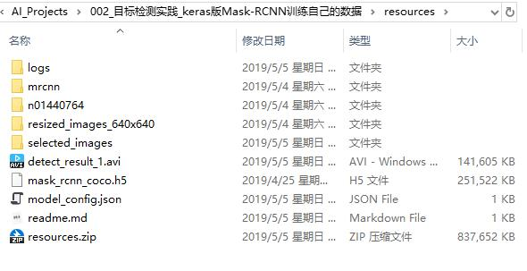

# 下载资源
本文件夹包含代码运行需要的各种资源，包括：软件安装包、代码运行依赖库、图片数据、文本数据等

## 下载链接
* 读者需要在百度云盘下载压缩文件`resources.zip`
* 下载链接: https://pan.baidu.com/s/1YnuJhJcKDtxBJ50KBXOWnA 提取码: stb2

## 解压后示意图
压缩文件解压后，文件夹`resources`中应该如下图所示：

## 讲解视频资源
本工程作者的讲解Mask-RCNN的视频，压缩文件`2018年4月28日讲解Mask-RCNN论文和实践.zip`
链接: https://pan.baidu.com/s/1mSljYS4VtpxMpRwMGKo47Q 提取码: ksbf 
