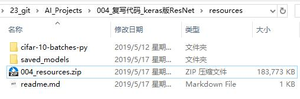

# 下载资源
本文件夹包含代码运行需要的各种资源，包括：软件安装包、代码运行依赖库、图片数据、文本数据等

## 下载链接
* 读者需要在百度云盘下载压缩文件`004_resources.zip`
* 下载链接: https://pan.baidu.com/s/1EQ5Yhg9k0AHPkrhjXMjGFQ 提取码: 9863

## 解压后示意图
压缩文件解压后，文件夹`resources`中应该如下图所示：

## 讲解视频资源
* 下面2个链接是相同的讲解视频
* 百度云盘下载链接: https://pan.baidu.com/s/1rvLhHvKnd6XUciBkydAuqQ 提取码: 85sf
* bilibili在线观看链接：https://www.bilibili.com/video/av52768866
