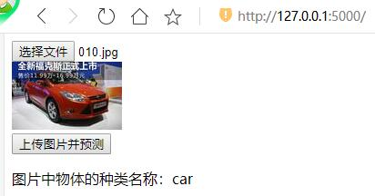
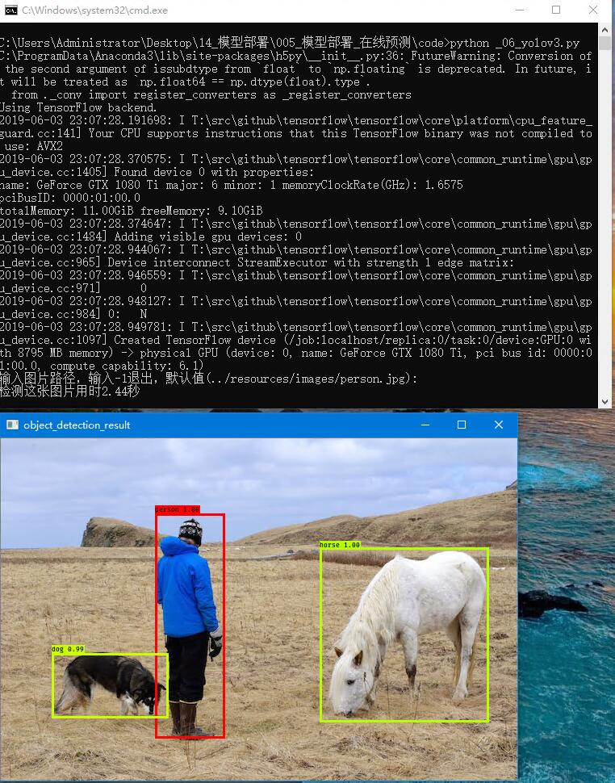
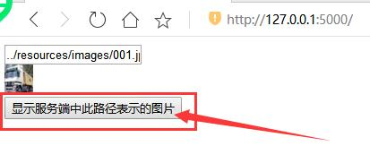
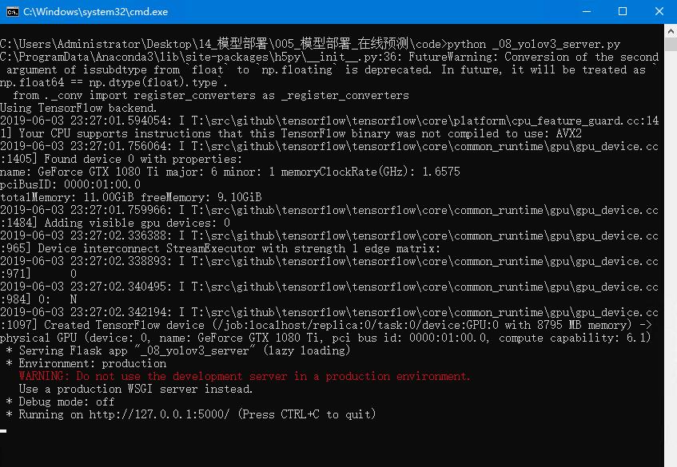
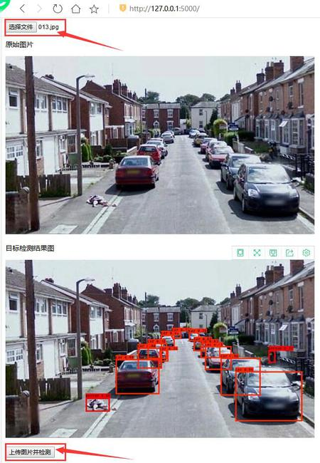
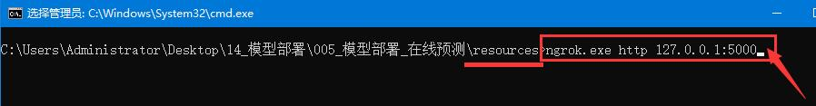
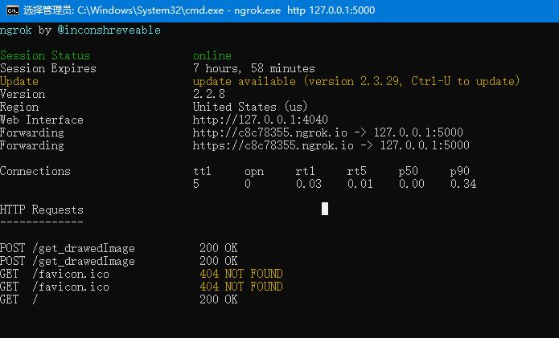
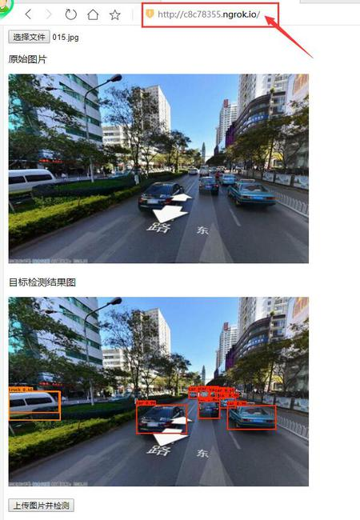
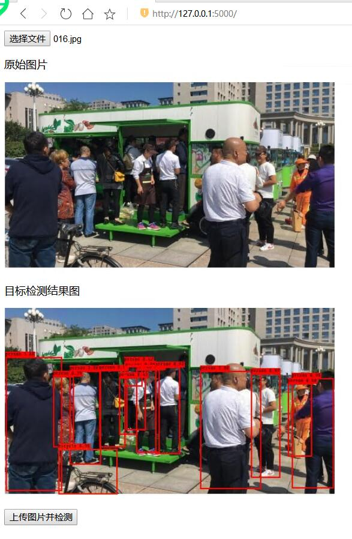
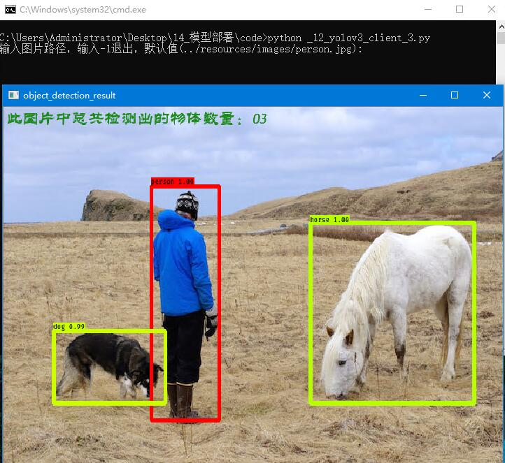

# 模型部署_在线预测

## 开发需求
1. 无web页面，对数据集cifar10中的图片数据做图片分类在线预测。
    * 1.1 纯终端运行，服务端开启服务后，客户端在cmd中传入需要检测图片的路径。
    * 1.2 服务端使用flask库接收post请求，客户端使用requests库发起post请求并打印返回值。

2. 有web页面，对数据集cifar10中的图片数据做图片分类在线预测。
    * 2.1 客户端上传图片后，接收图片分类结果，并把分类结果显示在web页面中。
    * 2.2 提交post请求后，不做网页跳转，停留在原始网页，从而使图像、预测种类名同时显示在同一网页。
    * 2.3 在网页中可以改变图片的显示大小。

3. 有web页面，服务端返回值为：已经画框的结果图。
    * 3.1 加载目标检测算法YOLOv3在COCO数据集80个种类已经训练好的权重文件，对任意图片完成目标检测，画框的结果图保存在服务端。
    * 3.2 客户端接收服务端发送的图片文件base64编码数据，解码后把图片显示在web页面中。
    * 3.3 把3.1和3.2结合，实现用YOLOv3算法对任意图片在线目标检测。
    * 3.4 客户端接收服务端中使用flask.url_for方法表示画框结果图的url，赋值url给标签img的属性src，即可把图片显示在web页面中。
    * 3.5 把3.1和3.4结合，实现与3.3相同的效果。

4. 有web页面，服务端返回值为：画框的结果图需要的box、classId、score这3个检测结果信息。
    * 4.1 加载目标检测算法YOLOv3在COCO数据集80个种类已经训练好的权重文件，对任意图片完成目标检测，返回检测结果信息给客户端。
    * 4.2 本地客户端上传图片后，利用接收的检测结果信息调用PIL库绘制检测结果图，把结果图用cv2库显示。
    * 4.3 实现网页前端压缩图片后上传，服务端能够正确解析收到的base64数据，能够把base64数据保存为图片文件，返回给客户端base64数据，客户端能够正确显示图片。
    * 4.4 把4.1、4.2、4.3、html5页面中的canvas标签绘制图像这4点结合起来，实现YOLOv3算法对任意图片在线目标检测。
    * 4.5 优化前端效果，例如：按钮"上传图片并检测"只能在选择文件后点击1次（减少重复发起请求）、通过checkbox选择是否显示种类名称和概率

5. 有web页面，客户端上传1个mp4格式视频文件，服务端返回值为：画框的结果图需要的box、classId、score这3个检测结果信息。
    * 5.1 上传时显示上传进度条
    * 5.2 上传完成后，服务端每检测1帧则返回检测结果信息，客户端实时绘制并显示。
    * 5.3 显示实时检测的FPS值
    * 5.4 提供“暂停”按钮，可以暂停动画显示检测结果图。
    * 5.5 提供“播放”按钮，从上次暂停时间点继续动画显示检测结果图。
    * 5.6 提供“保存为视频”按钮，把视频文件的目标检测结果动画保存为avi文件。
    * 5.7 当服务端未完成视频文件所有帧的检测时，“保存为视频”按钮不可点击。
    * 5.8 保存视频时，显示进度条。

6. 有web页面，客户端上传相机实时图像，服务端返回值为：画框的结果图需要的box、classId、score这3个检测结果信息。
    * 6.1 相机每拍摄1帧，则上传服务端1张图片。
    * 6.2 上传完成后，服务端每检测1张图片则返回检测结果信息，客户端实时绘制并显示。
    * 6.3 显示实时检测的FPS值
    * 6.4 提供“暂停”按钮，可以暂停动画显示实时检测结果图。
    * 6.5 提供“播放”按钮，从当前时间继续动画显示实时检测结果图。

## 0.下载资源
* 阅读[resources/readme.md](resources/)，并完成其中内容。

## 1.运行开发需求1相关代码
* 在Windows10系统，cmd命令脚本文件双击即可运行
* 1.1 双击cmd命令脚本文件`code/_01_开启服务_ResNet56v2图片分类模型.cmd`，cmd中运行结果如下图所示：

* 1.2 在已经开启服务的情况下（即第1.1节内容），双击cmd命令脚本文件`code/_02_客户端发送图片数据做分类检测.cmd`
* cmd中运行结果如下图所示，读者需要自己在：号之后输入图片路径。

* 1.3 查看服务端运行时cmd中打印的内容，如下图所示：

## 2.运行开发需求2.1相关代码
* 2.1 双击cmd命令脚本文件`code/_03_开启web版服务.cmd`
* 2.2 在已经开启服务的情况下（即第2.1节内容），在浏览器中访问链接：`127.0.0.1:5000`，浏览器中页面如下图所示：
* 

## 3.运行开发需求2.2、2.3相关代码
* 3.1 双击cmd命令脚本文件`code/_05_开启web服务.cmd`
* 3.2 在已经开启服务的情况下（即第3.1节内容），在浏览器中访问链接：`127.0.0.1:5000`
* 3.3 点击按钮`选择文件`，选中文件`resources/images/010.jpg`后，点击按钮`上传图片并预测`，浏览器中页面如下图所示：
* 

## 4.运行开发需求3.1的代码
**特别注意**：因为keras版YOLOv3作者`qqwweee`的网络架构设计，占用显存较大。
* 所以Windows系统需要11G显存显卡1080Ti，或者Ubuntu系统8G显存显卡。
* 4.1 关闭占用显存的cmd窗口，双击cmd命令脚本文件`code/_06_使用YOLOv3检测单张图片.cmd`
* 4.2 在cmd中输入图片路径，或者按Enter键使用默认值，运行结果如下图所示。
* 4.3 在cv窗口界面可以按Esc键或者q键退出，在cmd中可以多次输入路径检测多张图片。

## 5.运行开发需求3.2的代码
* 5.1 双击cmd命令脚本文件`code/_07_测试发送和接收base64数据.cmd`
* 5.2 在已经开启服务的情况下（即第5.1节内容），在浏览器中访问链接：`127.0.0.1:5000`
* 5.3 如下图红色箭头标记处所示，点击按钮`显示服务端中此路径表示的图片`，运行结果如下图所示。
* 5.4 读者可以修改文本框中的内容，然后点击按钮，可以展示另外的图。
* 

## 6.运行开发需求3.3的代码
### 6.1 局域网访问服务
**特别注意**：因为keras版YOLOv3作者`qqwweee`的网络架构设计，占用显存较大。
* 所以Windows系统需要11G显存显卡1080Ti，或者Ubuntu系统8G显存显卡。
1. 关闭占用显存的其他程序，双击cmd命令脚本文件`code/_08_开启YOLOv3检测服务.cmd`，cmd中运行结果如下图所示：

2. 在已经开启服务的情况下（即第6.1节内容），在浏览器中访问链接：`127.0.0.1:5000`
3. 如下图红色箭头标记处所示，点击按钮`选择文件`，选中文件`resources/images/013.jpg`后，点击按钮“上传图片并检测”，浏览器中页面如下图所示：

### 6.2 公网访问服务
1. 在6.1节的基础上，保持cmd开启，服务能够正常访问。
2. 使用软件ngrok完成端口映射，在文件夹`resources`中打开cmd。
3. cmd中运行命令：`ngrok.exe http 127.0.0.1:5000`，如下图所示：

4. ngrok成功运行时，cmd中如下图所示。动态分配公网链接，每次不同。

5. 从下图中可以看出，浏览器中链接为ngrok分配的公网链接。

6. 手机也可以访问Web服务，如下图所示：
* 

## 7.运行开发需求3.4的代码
* 7.1 双击cmd命令脚本文件`code/_09_测试访问static资源.cmd`
* 7.2 在已经开启服务的情况下（即第7.1节内容），在浏览器中访问链接：`127.0.0.1:5000`
* 7.3 如下图红色箭头标记处所示，点击按钮`显示服务端中此路径表示的图片`，运行结果如下图所示：

## 8.运行开发需求3.5的代码
* 8.1 关闭占用显存的其他程序，双击cmd命令脚本文件`code/_10_开启YOLOv3检测服务.cmd`
* 8.2 在已经开启服务的情况下（即第8.1节内容），在浏览器中访问链接：`127.0.0.1:5000`
* 8.3 点击按钮`选择文件`，选中文件`resources/images/016.jpg`后，点击按钮“上传图片并检测”，浏览器中页面如下图所示：
* 

## 9.运行开发需求4.1、4.2的代码
* 9.1 关闭占用显存的其他程序，双击cmd命令脚本文件`code/_11_开启YOLOv3检测服务.cmd`
* 9.2 在已经开启服务的情况下（即第9.1节内容），双击cmd命令脚本文件`code/_12_开启YOLOv3客户端.cmd`，输入图片路径后按Enter键，运行结果如下图所示：
* 
    
## 10.运行开发需求4.3的代码
* 10.1 双击cmd命令脚本文件`code/_13_测试前端压缩图片功能.cmd`     
* 10.2 在已经开启服务的情况下（即第10.1节内容），在浏览器中访问链接：`127.0.0.1:5000`
* 10.3 点击按钮`选择文件`，选中文件`resources/images/016.jpg`后，点击按钮“上传图片”，浏览器中界面如下图所示：

* 10.4 因为在本地做服务端模拟，所以上传图片并返回的速度很快。作者在代码文件`code/_13_receive_compressed_image.py`收到图片后延迟2秒再返回，从而模拟远程服务端延时的情况。
* 服务端延时2秒返回结果，出现上图情况后等待2秒，浏览器中界面如下图所示：

## 11.运行开发需求4.4、4.5的代码
* 需求4.4与需求4.1的python代码相同，但是需求4.4有Web前端开发，
    * 所以需求4.4仍然使用代码文件`code/_11_开启YOLOv3检测服务.cmd`
* 11.1 关闭占用显存的其他程序，双击cmd命令脚本文件`code/_11_开启YOLOv3检测服务.cmd`    
* 11.2 在已经开启服务的情况下（即第11.1节内容），在浏览器中访问链接：`127.0.0.1:5000`
* 11.3 点击按钮`选择文件`，选中文件`resources/images/014.jpg`后，点击按钮“上传图片并检测”，浏览器中界面如下图所示：

* 11.4 如下图红色箭头标记处所示，点击checkbox`是否显示种类名称和概率`，取消勾选，浏览器中界面如下图所示：
