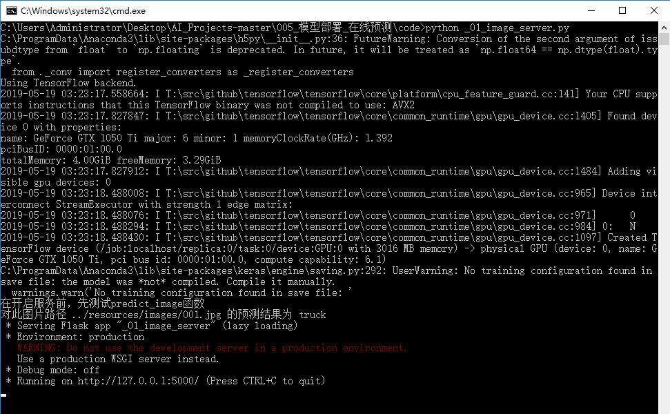
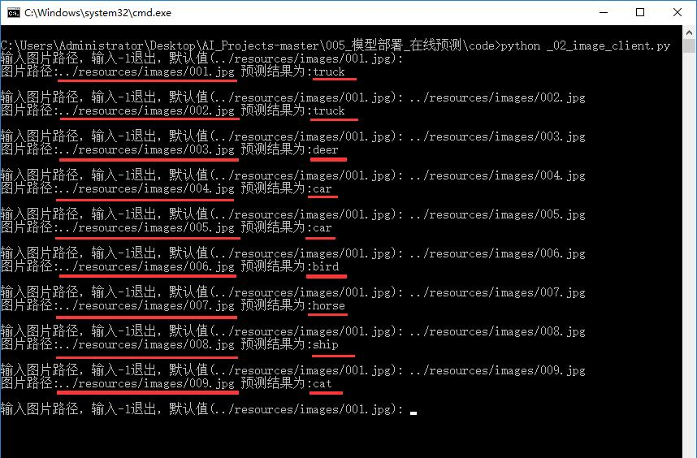
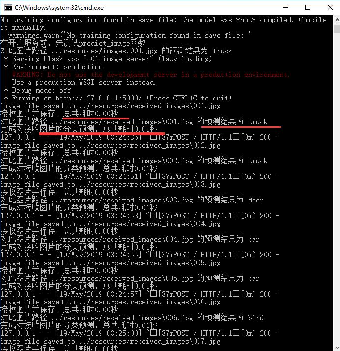

# 模型部署_在线预测

## 开发需求
1. 无web页面，对数据集cifar10中的图片数据做图片分类在线预测。
* 纯终端运行，服务端开启服务后，客户端在cmd中传入需要检测图片的路径。
* 服务端使用flask库接收post请求，客户端使用requests库发起post请求并打印返回值。

2. 有web页面，对数据集cifar10中的图片数据做图片分类在线预测。
* 客户端上传图片后，接收图片分类结果，并把分类结果显示在web页面中。
* 提交post请求后，不做网页跳转，停留在原始网页，从而使图像、预测种类名同时显示在同一网页。
* 在网页中可以改变图片的显示大小

3. 有web页面，服务端返回值为：已经画框的结果图。
* 对任意图片使用YOLOv3完成COCO数据集80分类的目标检测在线预测。
* 客户端上传图片后，接收目标检测已经画框的结果图，把结果图显示在web页面中。

4. 有web页面，服务端返回值为：画框的结果图需要的box、classId、score这3个检测结果信息。
* 对任意图片使用YOLOv3完成COCO数据集80分类的目标检测在线预测。
* 客户端上传图片后，接收检测结果信息后，利用其完成结果图的绘制，把结果图显示在web页面中。

5. 有web页面，客户端上传1个mp4格式视频文件，服务端返回值为：画框的结果图需要的box、classId、score这3个检测结果信息。
* 上传时显示上传进度条
* 上传完成后，服务端每检测1帧则返回检测结果信息，客户端实时绘制并显示。
* 显示实时检测的FPS值
* 提供“暂停”按钮，可以暂停动画显示检测结果图。
* 提供“播放”按钮，从上次暂停时间点继续动画显示检测结果图。
* 提供“保存为视频”按钮，把视频文件的目标检测结果动画保存为avi文件。
* 当服务端未完成视频文件所有帧的检测时，“保存为视频”按钮不可点击。

6. 有web页面，客户端上传相机实时图像，服务端返回值为：画框的结果图需要的box、classId、score这3个检测结果信息。
* 相机每拍摄1帧，则上传服务端1张图片。
* 上传完成后，服务端每检测1张图片则返回检测结果信息，客户端实时绘制并显示。
* 显示实时检测的FPS值
* 提供“暂停”按钮，可以暂停动画显示实时检测结果图。
* 提供“播放”按钮，从当前时间继续动画显示实时检测结果图。

## 0.下载资源
* 阅读[resources/readme.md](resources/)，并完成其中内容。

## 1.运行开发需求1相关代码
* 在Windows10系统，cmd命令脚本文件双击即可运行
    * 1.1 双击cmd命令脚本文件`code/_01_开启服务_ResNet56v2图片分类模型.cmd`，cmd中运行结果如下图所示：
    
    * 1.2 在已经开启服务的情况下（即第1.1节内容），双击cmd命令脚本文件`code/_02_客户端发送图片数据做分类检测.cmd`
    * cmd中运行结果如下图所示，读者需要自己在：号之后输入图片路径。
    
    * 1.3 查看服务端运行时cmd中打印的内容，如下图所示：
    
    

