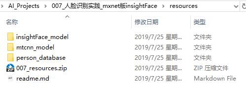

# 下载资源
本文件夹包含代码运行需要的各种资源，包括：软件安装包、代码运行依赖库、图片数据、文本数据等

## 下载链接
* 读者需要在百度云盘下载压缩文件`007_resources.zip`
* 链接: https://pan.baidu.com/s/18xVI9GPBEnYmwSb4-YdpYw 提取码: phfg

## 解压后示意图
压缩文件解压后，文件夹`resources`中应该如下图所示：

## 讲解视频资源
* 视频文件《2019年7月21日讲解insightFace工程实践.avi》
* 百度云盘下载链接: https://pan.baidu.com/s/19DCDimV_PnR_e-rbeayAjA 提取码: f2gw
* bilibili网站在线观看链接：https://www.bilibili.com/video/av60181354/
