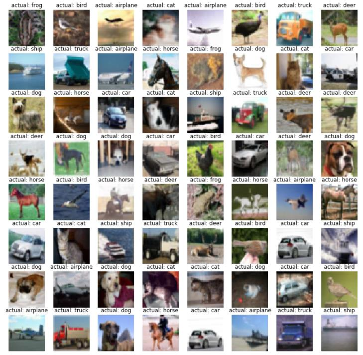
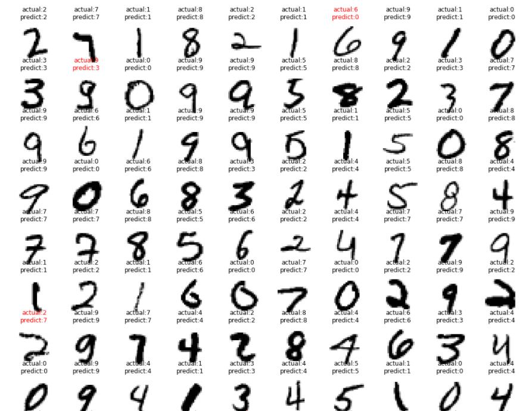

# 学习PyTorch_图像分类案例(MNIST和CIFAR10)
图像识别学习QQ群：111958809

## 下载资源
* 阅读[resources/readme.md](resources/)，并完成其中内容。

## 工程需求说明
1. 使用PyTorch完成MNIST手写数字数据集的图像分类任务
2. 使用PyTorch完成CIFAR10数据集的图像分类任务。
    * CIFAR10数据集介绍界面：https://www.cs.toronto.edu/~kriz/cifar.html    
    * 本人使用matplotlib库作图显示CIFAR10数据集的结果：

## 常见问题及解答
1. 如何运行此工程?
```
读者需要自己搭建环境，包括安装：conda、cuda、cudnn、pytorch1.1+
根据官方文档：cuda9.0适合安装pytorch1.1、cuda10.0适合安装pytorch1.2
环境搭建后, 双击命令脚本文件`code/_00_打开jupyter.cmd`, 即可进入jupyter界面
在jupyter界面中打开代码文件, 然后按照顺序运行代码即可
```

2. 工程需要的电脑配置？
```
电脑显卡必须是Nvidia系列，显存大于3G即可。
```

3. 工程说明
```
2个工程代码中都包括完整的图像识别流程：
    1. 数据准备
    2. 搭建神经网络
    3. 定义损失函数
    4. 在训练集上训练网络
    5. 在测试集上测试网络
MNIST数据集的工程中使用了3种神经网络模型，分别为：
    1. 含有输入层、输出层的2层神经网络模型，测试集准确率92%
    2. 含有输入层、1个隐藏层、输出层的3层神经网络模型，测试集准确率97%
    3. 含有2个卷积层、2个池化层的卷积神经网络模型，测试集准确率99.2%
CIFAR10数据集的工程中使用了2种神经网络模型，分别为：
    1. 含有2个卷积层、2个池化层的卷积神经网络模型，测试集准确率73%
    2. 仿照ResNet模型，搭建有20个卷积层的卷积神经网络模型，测试集准确率81.1%
```
本文作者在MNIST数据集训练第2种神经网络模型的可视化结果:
